# 🛡️ Awesome AI Content Moderation

  
  
  
  
  
  

> 🚀 A curated list of **Commercial SaaS Platforms** and **Self-Hosted Open-Source Models** for **AI Content Moderation**, Toxicity Detection, NSFW Image & Video Filtering, Hate Speech Classification, LLM Safety Guardrails, and Automated Trust & Safety.

📅 Last updated: **September 2026**

---

## 📌 Table of Contents

- [📊 Overview & Market Insights](#-overview--market-insights)
- [🏢 SaaS & Commercial Moderation Platforms](#-saas--commercial-moderation-platforms)
- [🔓 Open-Source Moderation Frameworks & Models](#-open-source-moderation-frameworks--models)
- [⚖️ Key Selection Criteria: SaaS vs. Open-Source](#%EF%B8%8F-key-selection-criteria-saas-vs-open-source)
- [❓ Frequently Asked Questions (FAQ)](#-frequently-asked-questions-faq)
- [🤝 How to Contribute](#-how-to-contribute)
- [💖 Support & Community](#-support--community)
- [📈 Star History](#-star-history)
- [⚠️ Disclaimer](#%EF%B8%8F-disclaimer)

---

## 📊 Overview & Market Insights

📈 **Estimated Market Size**: The global AI content moderation market is estimated at **$13.5 Billion in 2026** and is projected to reach **$35.2 Billion by 2032**, expanding at a compound annual growth rate (**CAGR**) of **18.5%**.

🧩 **Market Structure & Fragmentation**: The sector exhibits **moderate fragmentation**. It is anchored by hyperscale cloud infrastructure vendors (Microsoft Azure, Google Cloud, AWS) and large AI labs (OpenAI), alongside specialized Trust & Safety SaaS platforms (Hive AI, ActiveFence/Alice, Sightengine) providing domain-specific multimodal moderation and live moderation workflows.

---

## 🏢 SaaS & Commercial Moderation Platforms

Commercial moderation APIs offer high scalability, broad multi-lingual coverage, low maintenance overhead, and real-time policy enforcement across text, images, video, and audio.

### 💼 Commercial SaaS Solutions (Sorted by Valuation / Revenue)

> 💡 **Market Footprint**: The global AI content moderation market size is estimated at **$13.5 Billion in 2026**, growing at **18.5% CAGR** to over **$35 Billion by 2032**. The market is **moderately fragmented**, balancing hyper-scale cloud providers against agile, specialized Trust & Safety SaaS vendors.

| Provider / Platform | Key Features & Capabilities | Valuation / Company Revenue | Pricing (Starting Tier) | Free Tier / Trial Limit |
| :--- | :--- | :--- | :--- | :--- |
| **[Microsoft Azure AI Content Safety](https://azure.microsoft.com/products/ai-services/ai-content-safety)** | Enterprise text and image moderation, custom blocklists, multi-severity category scoring, and prompt shield for LLMs. | **~$3.1 Trillion** (Parent Valuation) / **~$245B** Revenue | **$0.38 per 1,000 text records** (up to 1k chars/record); **$1.00 per 1,000 images** | **5,000 text records & 5,000 image analyses per month** (F0 Free Tier) |
| **[Google Cloud Content Safety](https://cloud.google.com/vision/docs/safesearch-detection)** | SafeSearch image detection, explicit content classification, natural language moderation, and video intelligence filters. | **~$2.0 Trillion** (Parent Valuation) / **~$307B** Revenue | **$1.50 per 1,000 requests** (Vision SafeSearch); volume discounts above 5M units | **1,000 units per month free** (plus $300 new account credits) |
| **[Amazon Rekognition Moderation](https://aws.amazon.com/rekognition/pricing/)** | Image & video moderation detecting inappropriate, explicit, or violent content with hierarchical taxonomy tags. | **~$1.9 Trillion** (Parent Valuation) / **~$575B** Revenue | **$0.001 per image** ($1.00 / 1,000 images); **$0.10 per minute** of stored video | **1,000 images & 60 mins video per month** free for 12 months |
| **[OpenAI Moderation API](https://platform.openai.com/docs/guides/moderation)** | Automated text & multimodal classification endpoint detecting hate, self-harm, sexual content, violence, and harassment. | **~$80 Billion** (Valuation) / **~$3.7B** ARR | **$0.00** (Free endpoint for all OpenAI API accounts) | **Free unlimited moderation endpoint** (subject to account RPM/TPM rate limits) |
| **[Hive AI (thehive.ai)](https://thehive.ai/)** | Deep multimodal moderation for text, image, video, and audio; industry-standard AI-generated content detection. | **~$2.0 Billion** (Valuation) / **~$100M+** ARR | **$0.001 per image call**; pay-as-you-go & custom enterprise tiers | **$50–$100 free developer credits** upon sign-up & card verification |
| **[ActiveFence (Alice)](https://www.activefence.com/)** | End-to-end Trust & Safety intelligence platform for hate speech, child safety, threat intelligence, and policy enforcement. | **~$750 Million** (Valuation) / **$280M** Funding | **Custom enterprise pricing** based on volume & active features | **Custom enterprise demo & sandbox** upon inquiry (no public free tier) |
| **[Spectrum Labs](https://www.activefence.com/)** *(Acquired by ActiveFence)* | Contextual text moderation engine specializing in toxicity, hate speech, grooming detection, and voice chat moderation. | **~$500M+** (Parent Valuation) / **$46M** Funding | **Custom enterprise pricing** integrated with ActiveFence stack | **Custom enterprise demo** (no public free tier) |
| **[Checkstep](https://www.checkstep.com/)** | Flexible policy engine & AI content moderation workflow platform integrating open and proprietary AI models. | **~$10M–$25M** (Valuation) / **$9.1M** Funding | **$0.0008 per text request**; tiered usage pricing | **14-day free trial** with up to 10,000 free API test calls |
| **[Sightengine](https://sightengine.com/)** | Real-time image, video, and text moderation API for NSFW filtering, face detection, nudity, and user safety. | **~$10M–$20M** ARR (Profitable SaaS) | **$29/month** (Starter tier for 10,000 operations; extra ops at $0.002) | **2,000 operations per month** (max 500 ops/day) free forever |
| **[WebPurify](https://webpurify.com/)** | Profanity filtering API, automated photo/video moderation, and hybrid human-in-the-loop review teams. | **~$5M–$10M** ARR (Bootstrapped) | **$5/month** (Profanity filter for 10,000 requests); **$0.005/image** photo moderation | **14-day free trial** (Profanity) & **100 free photo moderations** |

---

## 🔓 Open-Source Moderation Frameworks & Models

Open-source projects allow developers, research teams, and privacy-focused enterprises to build self-hosted, offline-capable moderation pipelines without vendor lock-in.

### 🌟 Open-Source Repositories (Sorted by GitHub Stars)

1. **[NSFWJS](https://github.com/infinitered/nsfwjs)**   
   *Client-side and server-side Node.js & TensorFlow.js library for fast NSFW image classification (drawing, hentai, neutral, sexy, porn).*

2. **[Llama Guard / Llama Stack](https://github.com/meta-llama/llama-stack)**   
   *Meta's open-source LLM safety models (Llama Guard 3, Prompt Guard, CyberSecEval) for classifying toxic prompts, unsafe responses, and jailbreak attempts.*

3. **[Guardrails AI](https://github.com/guardrails-ai/guardrails)**   
   *Python framework for validating LLM inputs/outputs with structured guardrails, toxicity filtering, PII masking, and hallucination detection.*

4. **[NeMo Guardrails](https://github.com/NVIDIA/NeMo-Guardrails)**   
   *NVIDIA's open toolkit for adding programmable safety guardrails (topical control, safety, security, profanity) between users and LLMs.*

5. **[LLM Guard](https://github.com/protectai/llm-guard)**   
   *Open security toolkit by Protect AI for sanitizing LLM prompts and completions against toxicity, NSFW content, prompt injection, and PII leakage.*

6. **[NSFW Model](https://github.com/GantMan/nsfw_model)**   
   *Open-source Keras/TensorFlow model trained to classify NSFW images into 5 distinct safety categories for fast server-side filtering.*

7. **[Detoxify](https://github.com/unitaryai/detoxify)**   
   *PyTorch library for toxic comment classification with multi-label support (toxicity, severe toxicity, obscene, threat, insult, identity attack).*

8. **[Perspective API Client & Tools](https://github.com/conversationai/perspectiveapi)**   
   *Open tools and client libraries created by Jigsaw (Google) to detect toxic comments, host language models, and evaluate online conversation health.*

9. **[Content Moderation Deep Learning](https://github.com/fcakyon/content-moderation-deep-learning)**   
   *Deep learning framework using PyTorch and OpenCV for multi-modal moderation, covering nudity, violence, and profanity classification.*

10. **[Awesome Safety Tools](https://github.com/roostorg/awesome-safety-tools)**   
    *Directory of open tools for trust and safety, profanity filters, and behavioral classifiers for online platform safety.*

11. **[Surge AI Toxicity Scanners](https://github.com/surge-ai/toxicity)**   
    *Dataset and evaluation benchmarks for social media toxicity, hate speech, profanity, and context-aware content moderation models.*

12. **[LocalMod](https://github.com/KOKOSde/localmod)**   
    *Self-hosted, offline-first FastAPI moderation service supporting text toxicity ensembles, NSFW vision models, PII detection, and prompt injection filters.*

13. **[Safe Content AI](https://github.com/steelcityamir/safe-content-ai)**   
    *FastAPI wrapper around vision transformers and NSFW classifiers for easily deploying private image moderation endpoints.*

14. **[moderators](https://github.com/viddexa/moderators)**   
    *Unified CLI and Python API wrapper for running HuggingFace text and image safety models with standardized JSON outputs.*

15. **[OpenGuard AI](https://github.com/wispas/openguardai)**   
    *Open multimodal content safety framework for automated content moderation pipelines.*

---

## ⚖️ Key Selection Criteria: SaaS vs. Open-Source

| Dimension | Commercial SaaS APIs | Self-Hosted Open-Source |
| :--- | :--- | :--- |
| **🔒 Privacy & Security** | Data sent to cloud providers (subject to DPA terms) | Complete data isolation; data stays on local infrastructure |
| **⚡ Latency & Control** | Dependent on network latency and vendor uptime | Microsecond latency available with optimized GPU/CPU inference |
| **🎯 Accuracy & Updates** | Continuous vendor updates for evolving adversarial threats | Requires self-managed fine-tuning & model re-training |
| **🌐 Multimodal Coverage** | Combined text, image, audio, video out-of-the-box | Requires assembling separate text & vision model pipelines |
| **💰 Total Cost of Ownership** | Predictable per-request costs; zero infra overhead | Infrastructure & GPU hosting costs; engineering maintenance |

---

## ❓ Frequently Asked Questions (FAQ)

### 1. What is AI Content Moderation?
AI Content Moderation is the automated analysis of user-generated content (text, images, audio, video) using machine learning models to detect policy violations such as toxicity, hate speech, NSFW/adult content, violence, and spam.

### 2. Which is the best free AI moderation API?
**OpenAI Moderation API** provides a completely free moderation endpoint for text and images. **Sightengine** and **Azure AI Content Safety** also offer permanent free tiers for developer testing.

### 3. How do I self-host an NSFW image moderation model?
Projects like **NSFWJS** (JavaScript/Node.js) or **LocalMod** / **Safe Content AI** (Python/FastAPI) allow running pre-trained vision models locally using Docker or ONNX/TensorFlow runtimes.

---

## 🤝 How to Contribute

1. Fork this repository.
2. Edit `README.md` to add or update relevant tools.
3. Ensure entries maintain factual details, official links, and accurate star badges.
4. Submit a Pull Request.

---

## 💖 Support & Community

If you find this curated list helpful for your trust & safety research or engineering work, please consider supporting the project:

- ⭐ **Star this repository** to show your appreciation and help others discover it.
- 🔀 **Fork & Share** with your team, platform engineers, and trust & safety practitioners.
- ☕ **Sponsor or Buy Me a Coffee**: Support ongoing open-source maintenance via [GitHub Sponsors](https://github.com/sponsors/ishandutta2007).

---

## 📈 Star History

---

## ⚠️ Disclaimer

This repository is community-curated for informational purposes. Product specifications, pricing, and GitHub star counts are subject to change.
